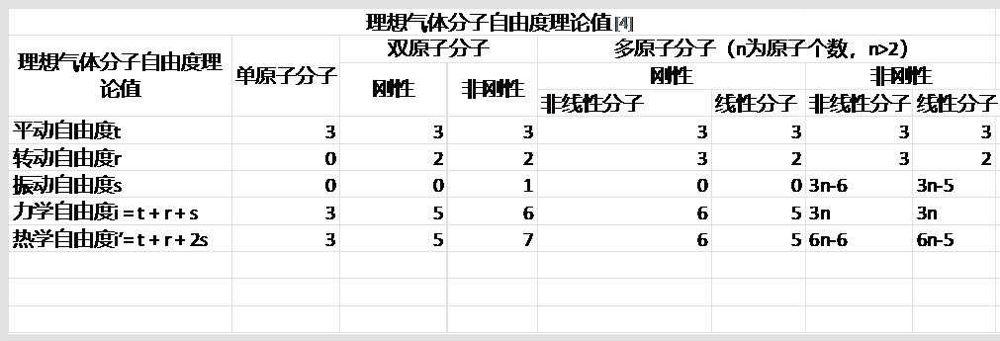
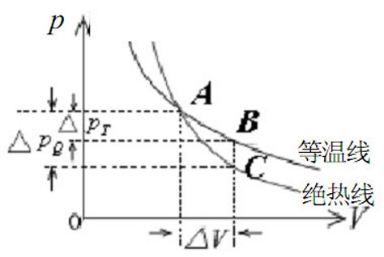
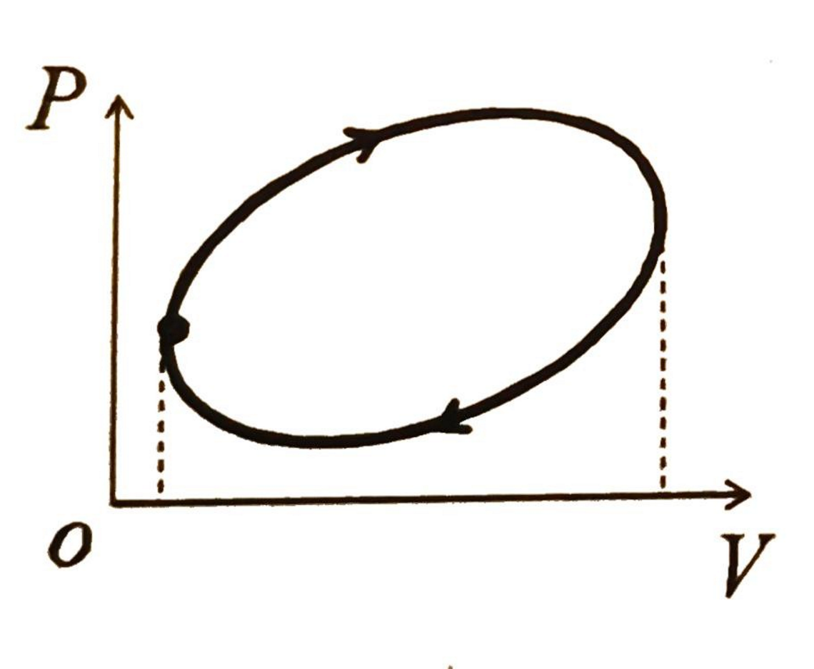
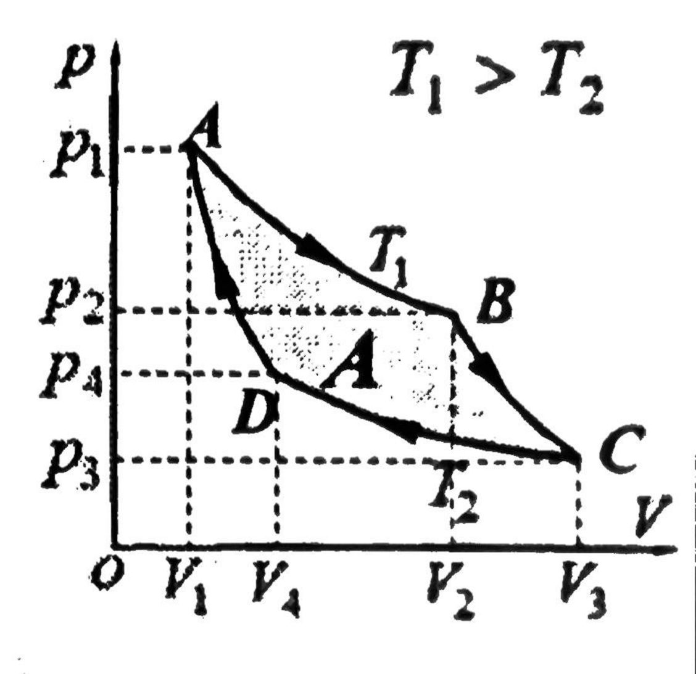

## 理想气体与状态方程
### 1. 理想气体的微观模型
   1. 分子可视为质点，且$r≫d$（$r$为间距，$d$为线度）
   2. 分子间碰撞为完全弹性
   3. 不考虑理想气体的势能
   4. 运动遵循经典力学
### 2. 理想气体的状态参量、平衡态
   1. 宏观量:
      1. $\displaystyle p=\frac{2}{3}n\overline{\epsilon_k} \quad n=\frac{N(总分子数)}{N_A}$ 
      2. $T=t+273.15K$
      3. 体积：
   2. 微观量：个别分子运动规律
   3. 平衡态：没有外界影响条件下热力学系统的各部分宏观性质在长时间里不发生变化的状态。 这里所说的没有外界影响，是指系统与外界没有相互作用，既无物质交换，又无 能量传递（做功和传热），即系统是孤立系。
   4. 准静态：若系统从始态到终态的过程，是由一连串无限临近平衡的状态构成，这样的过程就是准静态过程。
### 3. 状态方程
   1. 公式：$\displaystyle pV=\mu RT$
   2. 变形：$\displaystyle pV=\mu RT=\frac{m}{M}RT=\frac{N}{N_A}RT=NkT\quad (玻尔兹曼常数：k=\frac{R}{N_A} =1.38×10^{−23} J/K)$
   3. 准静态过程的描述：状态方程知二而求第三个，常用$p-V$图表示
### 4. 气体密度：
$\displaystyle pV=nRT=\frac{m}{M} RT⇒ρ=\frac{m}{V}=\frac{Mp}{RT}$
### 5. 理想气体压强：
   1. 分子平均平动动能：$\displaystyle \overline{\epsilon_k}=\frac{1}{2}m\overline{v^2}$
   2. 分子数密度：$n$
   3. 理想气体压强：$\displaystyle p=\frac{2}{3}n\overline{\epsilon_k}$
### 6. 温度的微观意义：
热力学温度只与平均平动动能有关
   $\displaystyle 
   \begin{cases} p=\frac{R}{N_A}\frac{N}{V}T=\mu kT \\ P=\frac{2}{3}n\overline{\epsilon_k} \end{cases}\Rightarrow\overline{\epsilon_k}=\frac{2}{3}kT \quad T=\frac{2\overline{\epsilon_k}}{3k}
   $
### 7. 混合气体的压强：
   1. 气体分压定律：
   $\displaystyle\sum_{i=0}^n p_i=p\qquad (p_i——组分气体以混合气体温度单独占有容器时的压强，T,V相同)$
   2. 气体分容定律：
   $\displaystyle \sum_{i=0}^nV_i=V \qquad (V_i——组分气体以混合气体温度、压强占有容器时的体积，T,P相同)$ 
---
## 热力学第一定律
### 1.自由度
   
   1. 能量按自由度等分原理：分子在每一个自由度上具有相同的动能，其大小等于$\displaystyle \frac{1}{2}KT$
### 2. 物体的内能：
   1. 动能：分子平均平动动能+分子平均转动动能+分子平均振动动能
   2. （势能：由分子间距有关）**理想气体不考虑**
   3. 内能：动能+势能的总和
### 3. 理想气体的内能：
   1. $\displaystyle E=\frac{i}{2} \mu RT\Rightarrow \begin{cases} i=3(单) \\ i=4(刚性双原子/线性分子) \\ i=5(刚性非线性) \end{cases}$ 
   2. **一定量的理想气体的内能只和$T$有关** 
   3. 对任意过程有：$\displaystyle \Delta E=\frac{i}{2} \mu R\Delta T$
### 4. 热力学第一定律
   1. $\Delta E=Q+W$
   2. 微分形式：$\displaystyle dE=dQ+dW$
   3. $\begin{cases} Q>0(系统吸热) \\ W>0(外界对系统做功) \\ \Delta E>0(系统内能增加) \end{cases}$
### 5. 比热、摩尔热容量、功与热量
   1. 比热：单位质量物质温度升/降$1K$吸收/放出的热量，常用$C$表示
   2. 热容：某过程中，物体升高/降低$1℃$吸收/放出的热量
   3. 摩尔热容量：一摩尔物质温度升/降$1K$吸收/放出的热量
      1. 定容摩尔热容量（$C_v$）：一摩尔物质在体积不变条件下，温度升/降$1K$吸收/放出的热量
      2. 定压摩尔热容量（$C_p$）：一摩尔物质在压强不变条件下，温度升/降$1K$吸收/放出的热量
      3. **$C_p=C_v+R$**
   4. 热量的计算：
      1. 通式：$Q=cmΔT$
      2. 对于特殊过程
         1. 等容过程：$Q=νC_v ΔT$
         2. 等压过程：$Q=νC_p ΔT$
         3. 任意过程：$Q=W−ΔE$
         4. 对于无限小过程：
         	1. $\displaystyle Q=\int_{V_1}^{V_2}C(V)  \mathrm{d}V$
      		2. $\displaystyle Q=\int_{T_1}^{T_2}C(T)  \mathrm{d}T$
   5. 外界对理想气体做功的计算
      1. 元功的表达式：$dW=Fdx=pSdx=−pdV$
      2. $W=$外界对气体的做功
         1. 气体被压缩，$W>0$
         2. 气体膨胀，$W<0$
---
## 理想气体的特殊变化过程
### 1. 等容变化$(V=Const)$
   1. $\displaystyle \frac{p}{V}=Const$
   2. 系统做功或外界对系统做功$W=0$
   3. $\displaystyle \begin{cases} Q=\nu C_V\Delta T \\ \Delta E=\frac{i}{2} \nu R\Delta T\\Q=\Delta E \end{cases}\Rightarrow C_V=\frac{i}{2}R$
      1. $\displaystyle C_V=\frac{i}{2}R\begin{cases} i=3\\ i=4\\ i=5 \end{cases}$
      2. **无论什么过程，内能变化量可表示为：$\displaystyle ΔE=vC_v ΔT$**
### 2. 等压过程$(P=Const)$
   1. $\frac{V}{T}=Const$
   2. $\displaystyle W=-p\int_{V_1}^{V_2}  \mathrm{d}V=-p(V_2-V_1)=-\nu R(T_2-T_1)=-\nu R\Delta T$
   3. $Q=\nu C_p ΔT$
   4. 根据热力学第一定律：$ΔE=Q+W$
      1. $νC_v ΔT=νC_P ΔT−νRΔT$
      2. $C_p=C_v+R$
### 3. 等温过程$(T=Const)$
   1. $pV=Const$
   2. $\Delta E=0$
   3. $Q=-W$（吸收的热全部用来对外做功）
   4. $\displaystyle W=-\int_{V_1}^{V_2} p \mathrm{d}V=-\int_{V_1}^{V_2} \frac{\nu RT}{V} \mathrm{d}V=-\nu RT\ln \frac{V_2}{V_1}$
   5. $C_r=\infty$
### 4. 绝热过程（系统在状态变化过程中，始终不与外界交换热量的过程）
   1. $Q=0(C_\gamma=0)$
   2. $W=\Delta E=\nu C_V \Delta T(dW=dE=\nu C_VdT)$
   3. 绝热压缩，外界对系统做的功全部用来增加内能（体积变小，温度升高，压强增大）;绝热膨胀，系统对外界做功是以消耗内能为代价的（体积变大，温度降低，压强减小）
   4. 理想气体绝热准静态过程：$pV=νRT$
      1. 泊松公式：$\displaystyle pV^γ=Const\qquad \\ 其中：\gamma=\frac{C_P}{C_V}=1+\frac{R}{C_V}(比热容比(绝热指数))$
      2. $\displaystyle \gamma=\begin{cases} \frac{5}{3}(单原子分子理想气体)\\ \frac{7}{5}(刚性双原子分子或线性分子理想气体)\\\frac{4}{3}(刚性非线性分子理想气体) \end{cases}$
      3. 泊松公式推广：
         1. $\displaystyle \begin{cases} TV^{1-\gamma}=Const\\ \displaystyle  \frac{p^{\gamma-1}}{t^\gamma}=Const \end{cases}$
         2. 等量关系(绝热过程)：
            * $$\displaystyle \begin{cases} p_1V_1^\gamma=p_2V_2^\gamma \\ T_1V_1^{1-\gamma}=T_2V_2^{1-\gamma} \\\displaystyle  \frac{p_1^{\gamma-1}}{T_1^\gamma}=\frac{p_2^{\gamma-1}}{T_2^\gamma} \end{cases}$$
         3. 准静态绝热过程曲线(由于$γ>1$，所以绝热线要比等温线陡一些)!
            
         4. 绝热过程功的计算（末态−初态）
            $$\displaystyle \begin{cases} W=\Delta E=\nu C_V \Delta T\\C_V=\frac{R}{\gamma-1} \end{cases}\Rightarrow  W= \displaystyle \frac{1}{\gamma-1}\nu R(T_1-T_2) \tag{1}$$   
            $$\displaystyle \begin{cases} (1) \\ pV=\nu RT \end{cases}\Rightarrow W=\frac{1}{\gamma-1}(P_1V_1-P_2V_2)$$

### 5. 绝热自由膨胀过程（非准静态过程）——气体向真空无阻力膨胀过程:
   1. $\displaystyle \begin{cases} W=0, & Q=0 \\ \Delta E=0, & pV=\nu RT \end{cases} \\ 若绝热膨胀后气体还是一个整体，则ΔT=0$
---
## 循环过程
* 气体系统通过一系列变化又回到原来状态的过程，可用$p−V$图上的一条闭合图线表示
  * 正循环：$p−V$图上的过程是顺时针
  * 逆循环：逆时针
   
* 系统从某一状态又回到某一状态，$T$不变，即内能不变：$ΔT=0,ΔE=0$
* $W=±|p−V图线下面积|$
  * 正循环：对外做功>对内做功，$W<0$——热机循环
  * 负循环：对外做功<对内做功，$W>0$——制冷循环
* $Q=-W \\ (气体吸收的热量全部用来对外做功或外界对系统所做的功全部以热量的形式放出，内能不变)$
### 1. 正循环（热机循环）
系统对外做功，需要吸热，**但吸收的热量不可能完全变成有用的功而不产生其他影响**，需要向低温热源放热，及吸收的热量中只有一部分可以转化为对外做的功。
1. 做功：设正循环中，系统吸热$Q_1$，放热$Q_2$，则系统对外做功：
   $$A=−W⟹A=Q_1−Q_2 (Q_1>Q_2)$$
2. 热机效率：在正循环中，工作物质对外所作的功$A$与它所吸收的热量$Q_1$的比值
   $$η=A/Q_1 =(Q_1−Q_2)/Q_1 =1−Q_1/Q_2 (效率=收益/代价)\\——吸收的热量Q_1 中有多少转化为对外的功$$
### 2. 逆循环（制冷循环）
   * 热量不可能自动地从低温热源传到高温物体，而不发生其他变化。想制冷，需要外界做功，即从冷库中吸收热量要以做功为代价。
   1. 设逆循环中，系统吸热$Q_1$，放热$Q_2$，外界对系统做功$W$，则
      $$W=Q_1-Q_2(Q_1>Q_2)$$
   2. 制冷系数：在一个循环中工作物质从冷库中吸收的热量$Q_2$与外界对系统做的功$W$的比值
      $$\displaystyle ε=Q_2/W=Q_2/(Q_1−Q_2 )  \\ (对系统做功W能换取系统从冷库中吸收多少热量(效率=\frac{收益}{代价}))$$
### 3. 卡诺循环
   * 工作物质只与两个恒温热源恒定温度的高温热源($T_1$)与恒定温度的低温热源($T_2$)交换热量的循环叫卡诺循环，相应的热机称为卡诺热机。
   * 
     1. 卡诺循环是由两个（准静态）等温过程和两个（准静态）绝热过程组成；
     2. 卡诺热机不计摩擦、热损失和漏气，可视为理想热机。
     3. $A→B$等温膨胀 $B→C$绝热膨胀 $C→D$等温压缩 $D→A$绝热压缩
   1. 理想气体卡诺循环热机效率的计算：
     1. $A→B$等温膨胀吸热：$\displaystyle Q_1=νRT \ln \frac{V_2}{V_1}$
     2. $B→C$绝热膨胀：$\displaystyle V_2^{γ−1} T_1=V_3^{γ−1} T_2$
     3. $C→D$等温压缩放热：$\displaystyle Q_2=νRT\ln \frac{V_3}{V_4}$
     4. $D→A$绝热压缩：$\displaystyle V_1^{γ−1} T_1=V_4^{γ−1} T_2$
     5. 推得：
         $$\displaystyle \begin{cases} \displaystyle \frac{V_2}{V_1} = \frac{V_3}{V_4} (1) \\ \displaystyle  \frac{Q_1}{T_1} =\frac{Q_2}{T_2} \end{cases}\Rightarrow \displaystyle  \mu =1-\frac{Q_2}{Q_1}=1-\frac{T_1}{T_2}\frac{\ln \frac{V_3}{V_4}}{\ln \frac{V_2}{V_1}}(2)\\ \begin{cases} (1) \\ (2) \end{cases}\Rightarrow \mu =1-\frac{T_2(高温)}{T_1(低温)}$$
         1. 卡诺热机的效率只与$T_1$ 、$T_2$ 有关，与工作物无关，与气体的质量无关，与$P$、$V$的变化无关；
         2. 两热源的温差越大，循环效率越高；提高效率只需增加温差（实用上是提高$T_1$）
   2. 卡诺逆循环（卡诺制冷机）的功率：
      $$\displaystyle ε=\frac{Q_2}{A}=\frac{Q_2}{Q_1−Q_2}=\frac{T_2}{T_1−T_2}\\ (🔗热力学第二定律：低温热源的热量是不会自动地传向高温热源的，要以消耗外界做功为代价)$$
